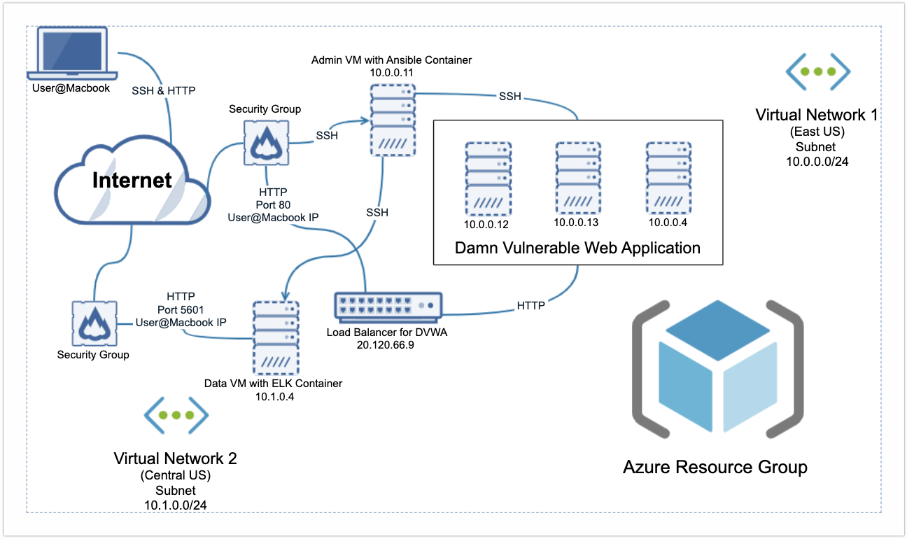

# Elk-Stack


### Overview

This project required me to create a virtual peered network in Azure and develop understanding in a few key areas:

<ol>
  <li>Cloud Networking</li>
  <li>Firewall Policies</li>
  <li>Deployment & Automation Tools</li>
  <li>Monitoring & Logging</li>
</ol>

### Network Machines

The following table outlines the network VMs:

| vMachine  | Private IP Address  | Operating System  | Location | Load Balancer
|---|---|---|---|---|
| Jump-Box  | 10.0.0.11  | Linux (Ubuntu 20.04) | East US | No
| Elk  | 10.1.0.11  | Linux (Ubuntu 18.04)  | Central US | No
| Web-1  | 10.0.0.12  | Linux (Ubuntu 20.04) | East US | Yes
| Web-2  | 10.0.0.13  | Linux (Ubuntu 20.04)  | East US | Yes
| Web-3  | 10.0.0.4  | Linux (Ubuntu 18.04) | East US (Zone 1) | Yes

### SSH Connections

I wrote a firewall policy that allows SSH connections from my Macbook to servers in my Azure network. I also created a jump box provisioner to serve as an admin machine that runs an Ansible container with Docker.

Using the jump box's public IP address, I SSH into that machine from my Macbook to remotely access and manage the network. 

I also wrote a policy that allows SSH connections from the jump box machine to other servers in my network. From the jump box, I can SSH into any VM and also execute scripts to install and launch modules on multiple machines.


### Ansible

After downloading Docker on the jump box, I pulled an Ansible container (an image named ```cyberxsecurity/ansible```).

The following image shows how I run the Ansible container.


The Ansible container has a directory ```/etc/ansible``` with some config files. I used this directory to add additional config and playbook files.

Ansible provides a simple solution to group machines in its hosts file:

```
[webservers]
10.0.0.4
10.0.0.12
10.0.0.13

[elk]
10.1.0.4
```

This config is used to target machines by groups in YAML scripts:

```
---
- name: Install and Launch Filebeat on Webservers
  hosts: webservers
```

### Filebeat & Metricbeat

Metricbeat and Filebeat are used to capture data on the network (CPU usage %, number of containers, processes, network traffic, etc). 

This chart shows lots of failed SSH attempts, which could indicate an attack:


Here's a log that captures a failed SSH connection attempt:
```
{
  "_index": "filebeat-7.6.1-2021.12.09-000001",
  "_type": "_doc",
  "_id": "kNratn0BqAB6T-wxIxPD",
  "_score": null,
  "_source": {
    "agent": {
      "hostname": "Web-2",
      "id": "882810d9-f91f-4ede-b8cc-6c7854d51674",
      "type": "filebeat",
      "ephemeral_id": "d782e166-f5f9-4cc3-9ae6-49947a6766ac",
      "version": "7.6.1"
    },
    "process": {
      "name": "sshd",
      "pid": 3148
    },
    "log": {
      "file": {
        "path": "/var/log/auth.log"
      },
      "offset": 21142
    },
    "source": {
      "ip": "10.0.0.11"
    },
    "fileset": {
      "name": "auth"
    },
    "input": {
      "type": "log"
    },
    "@timestamp": "2021-12-14T02:51:28.000Z",
    "system": {
      "auth": {
        "ssh": {
          "event": "Invalid"
        }
      }
    },
    "ecs": {
      "version": "1.4.0"
    },
    "service": {
      "type": "system"
    },
    "host": {
      "hostname": "Web-2",
      "name": "Web-2"
    },
    "event": {
      "timezone": "+00:00",
      "module": "system",
      "action": "ssh_login",
      "type": "authentication_failure",
      "category": "authentication",
      "dataset": "system.auth",
      "outcome": "failure"
    },
    "user": {
      "name": "asasasas"
    }
  },
  "fields": {
    "suricata.eve.timestamp": [
      "2021-12-14T02:51:28.000Z"
    ],
    "@timestamp": [
      "2021-12-14T02:51:28.000Z"
    ]
  },
  "highlight": {
    "event.dataset": [
      "@kibana-highlighted-field@system.auth@/kibana-highlighted-field@"
    ]
  },
  "sort": [
    1639450288000
  ]
}
```

While the IP is from the local network (no public IPs are allowed to make direct SSH connections with this VM), this log illustrates how the system captures events that security analysts can use to understand user behavior.


